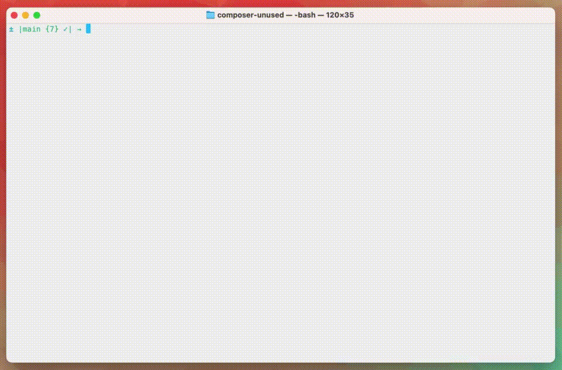

<p align="center">
    
</p>

# composer-unused
A Composer tool to show unused Composer dependencies by scanning your code.

Created by [Andreas Frömer](https://twitter.com/icanhazstring) and [contributors](https://github.com/composer-unused/composer-unused/graphs/contributors), logo by [Caneco](https://twitter.com/caneco).

[](https://github.com/composer-unused/composer-unused)
[](https://github.com/composer-unused/composer-unused)
[](https://github.com/composer-unused/composer-unused/releases/latest)

## Motivation

When working in a big repository, you sometimes lose track of your required Composer
packages. There may be so many packages you can't be sure if they are actually used or not.

Unfortunately, the `composer why` command only gives you the information about why
a package is installed in dependency to another package.

How do we check whether the provided *symbols* of a package are used in our code?

`composer unused` to the rescue!



## Installation

⚠️ This tool heavily depends on certain versions of its dependencies. A **local installation of this tool is not recommended** as it might not work as intended or can't be installed correctly. We do recommened you download the `.phar` archive or use **PHIVE**  to install it locally.

### PHAR (PHP Archive) (recommended)
Install via `phive` or grab the latest `composer-unused.phar` from the latest release:

    phive install composer-unused --trust-gpg-keys DB82D6DEA49B570163338FA33135AA4CB4F1AB0B
    curl -OL https://github.com/composer-unused/composer-unused/releases/latest/download/composer-unused.phar

### Local
You can also install `composer-unused` as a local __development__ dependency:

    composer require --dev icanhazstring/composer-unused

## Usage
Depending on the kind of your installation the command might differ.

*Note: Packages must be installed via `composer install` or `composer update` prior to running `composer-unused`.*

### PHAR
The `phar` archive can be run directly in you project:

    php composer-unused.phar

### Local
Having `composer-unused` as a local dependency you can run it using the shipped binary:

    vendor/bin/composer-unused

### XDebug Performance
For optimal performance, `composer-unused` automatically disables XDebug when it's running to avoid memory overhead and potential compatibility issues. 

If you need to debug `composer-unused` itself or run it with XDebug enabled, you can set the `COMPOSER_UNUSED_ALLOW_XDEBUG=1` environment variable:

    COMPOSER_UNUSED_ALLOW_XDEBUG=1 php composer-unused.phar

### Exclude folders and packages
Sometimes you don't want to scan a certain directory or ignore a Composer package while scanning.
In these cases, you can provide the `--excludeDir` or the `--excludePackage` option.
These options accept multiple values as shown next:

    php composer-unused.phar --excludeDir=config --excludePackage=symfony/console
    php composer-unused.phar \
        --excludeDir=bin \
        --excludeDir=config \
        --excludePackage=symfony/assets \
        --excludePackage=symfony/console

> Make sure the package is named exactly as in your `composer.json`

### Configuration
You can configure composer-unused by placing a `composer-unused.php` beside the projects `composer.json`
This configuration can look something like this: [composer-unused.php](composer-unused.php)

#### Ignore dependencies by name
To ignore dependencies by their name, add the following line to your configuration:

```
$config->addNamedFilter(NamedFilter::fromString('dependency/name'));
```

#### Ignore dependencies by pattern
To ignore dependencies by pattern, add the following line to your configuration

```
$config->addPatternFilter(PatternFilter::fromString('/dependency\/name/'));
```

> You can ignore multiple dependencies by a single organization using `PatternFilter` e.g. `/symfony\/.*/`

#### Configuration Sets
For common framework setups, you can use predefined configuration sets that automatically configure additional scan paths:

```php
use ComposerUnused\ComposerUnused\Configuration\ConfigurationSet\SymfonyConfigurationSet;

$composerJson = json_decode(file_get_contents(__DIR__ . '/composer.json'), true);
$rootPackageName = $composerJson['name'] ?? 'root';

$config->applyConfigurationSet(new SymfonyConfigurationSet($rootPackageName));
```

**Available Configuration Sets:**
- **SymfonyConfigurationSet**: Automatically scans `bin/`, `config/`, `public/`, `assets/`, and `migrations/` directories for Symfony projects

See [examples/symfony-composer-unused.php](examples/symfony-composer-unused.php) for a complete example.

#### Creating Custom Configuration Sets
You can create your own configuration sets by implementing the `ConfigurationSetInterface`:

```php
use ComposerUnused\ComposerUnused\Configuration\Configuration;
use ComposerUnused\ComposerUnused\Configuration\ConfigurationSetInterface;

final class MyFrameworkConfigurationSet implements ConfigurationSetInterface
{
    public function apply(Configuration $configuration): Configuration
    {
        // Add your custom configuration logic here
        return $configuration;
    }

    public function getName(): string
    {
        return 'my-framework';
    }

    public function getDescription(): string
    {
        return 'Custom configuration for My Framework';
    }
}
```

#### Additional files to be parsed
Per default, `composer-unused` is using the `composer.json` autoload directive to determine where to look for files to parse.
Sometimes dependencies don't have their composer.json correctly set up, or files get loaded in another way.
Using this, you can define additional files on a per-dependency basis.

```
$config->setAdditionalFilesFor('dependency/name', [<list-of-file-paths>]);
```

## Changelog

Please have a look at [`CHANGELOG.md`](CHANGELOG.md).

## Contributing

Please have a look at [`CONTRIBUTING.md`](CONTRIBUTING.md).

## Code of Conduct

Please have a look at [`CODE_OF_CONDUCT.md`](CODE_OF_CONDUCT.md).

## License

This package is licensed under the [MIT License](LICENSE).
